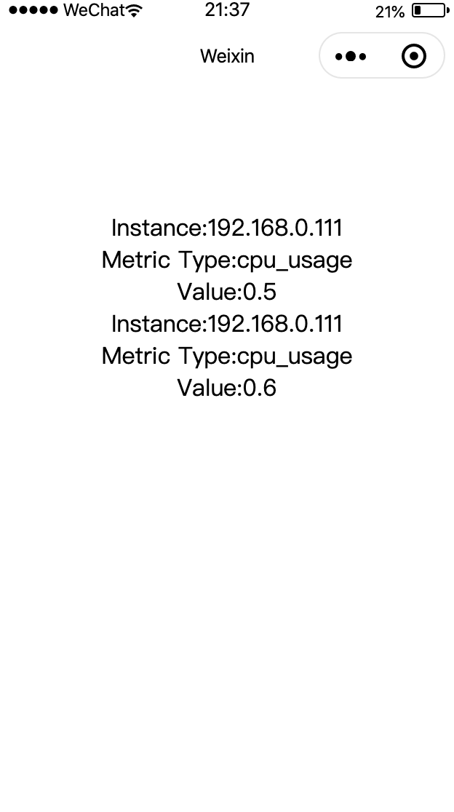
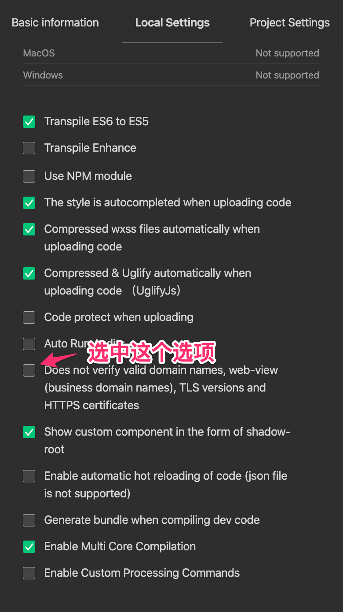
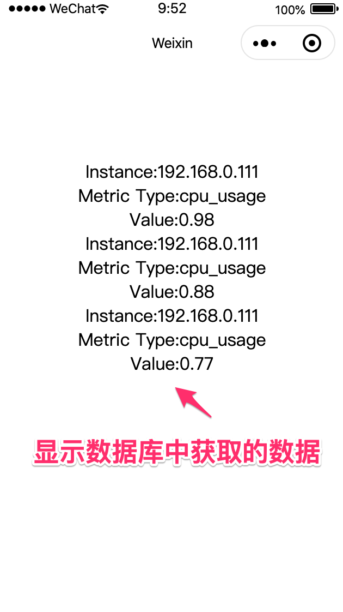

## 小程序应用开发

### 创建小程序工程

打开微信开发者工具，新建小程序工程，AppID 使用测试账号(Test Account)。

### 添加测试数据

在`pages/index/index.js`文件中添加测试数据，添加到`Page`的`data`变量中。

```javascript
canIUse: wx.canIUse('button.open-type.getUserInfo'),
/* 注意代码添加位置 */
metrics: [
  {
    id: 1,
    instance: "192.168.0.111",
    metric_type: "cpu_usage",
    value: 0.5,
    created_at: "2020-10-01 00:00:01",
  },
  {
    id: 2,
    instance: "192.168.0.111",
    metric_type: "cpu_usage",
    value: 0.6,
    created_at: "2020-10-01 00:01:01",
  },
]
```

### 在页面中显示数据

修改`pages/index/index.wxml`文件，显示新添加的数据。

```html

<!--index.wxml-->
<view class="container">
  <block wx:for="{{metrics}}">
    <text>Instance:{{item.instance}}</text>
    <text>Metric Type:{{item.metric_type}}</text>
    <text>Value:{{item.value}}</text>
  </block>
</view>

```

```tip
`wx:for`是微信小程序的一个wxml语法，详细说明参考：[列表渲染](https://developers.weixin.qq.com/miniprogram/dev/reference/wxml/list.html)
```

显示结果如下图所示：



### 连接 REST API 获取数据

#### 修改配置

因为使用本地服务器作为数据源 URL，所以需要修改微信开发者工具的本地配置，选中不验证域名合法性的选项，如下图所示：



#### 修改 `index.js`的 `onload` 方法

将`onload`方法修改如下：

```javascript
onLoad: function () {
    var that = this;
    wx.request({
      url: 'http://localhost:3000/metrics',
      method:'GET',
      success:function(res){
        var metrics = [];
        res.data.forEach(v=>{
          metrics.push({
            id:v.id,
            instance:v.instance,
            metric_type:v.metric_type,
            value:v.value
          })
        });
        that.setData({
          "metrics":metrics
        })
      }
    })
  },
```

保存以上修改后，小程序界面会显示从数据库中获取的数据，如下图所示：


